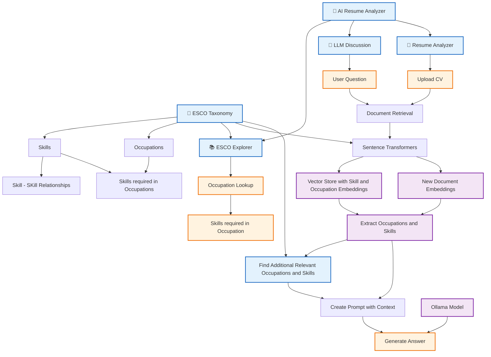

# AI Resume Analyzer

An AI-powered career analysis application that combines **ESCO (European Skills, Competences, Qualifications and Occupations) skill and occupation data**, **retrieval-augmented generation (RAG)**, **local LLM inference with Ollama**, and **Streamlit** to explore occupations and skills, answer career questions, and analyze uploaded resumes.

## Overview

The project demonstrates how structured domain knowledge can be combined with vector retrieval and LLMs.

## Architecture


## Main Features

### ESCO Explorer
- Browse occupations and descriptions.
- Retrieve related skills through ESCO relationships.
- Inspect occupation-skill mappings and URIs.

### LLM Discussion
Ask natural-language career questions. The system retrieves relevant ESCO documents first, formats them into context, and then asks Ollama to answer using that retrieved knowledge.

### Resume Analyzer
Upload a CV and analyze it against ESCO knowledge for:
- detected skills;
- related occupations;
- skill gaps;
- recommended skills;
- possible career directions.


## ESCO Data

Expected source files (create data/ and retrieve data from ESCO):

```text
skill_en.ods
occupations_en.ods
occupationSkillRelations.ods
skillSkillRelations_en.ods
```

## Ollama

Example model:

```text
llama3.2:3b
```

Pull it with:

```bash
ollama pull llama3.2:3b
```

Install dependencies:

```bash
pip install -r requirements.txt
```

## Run

```bash
streamlit run main.py
```

## Technologies

- Python
- Streamlit
- pandas
- ESCO
- LangChain
- sentence-transformers
- vector retrieval
- Ollama
- pytest


