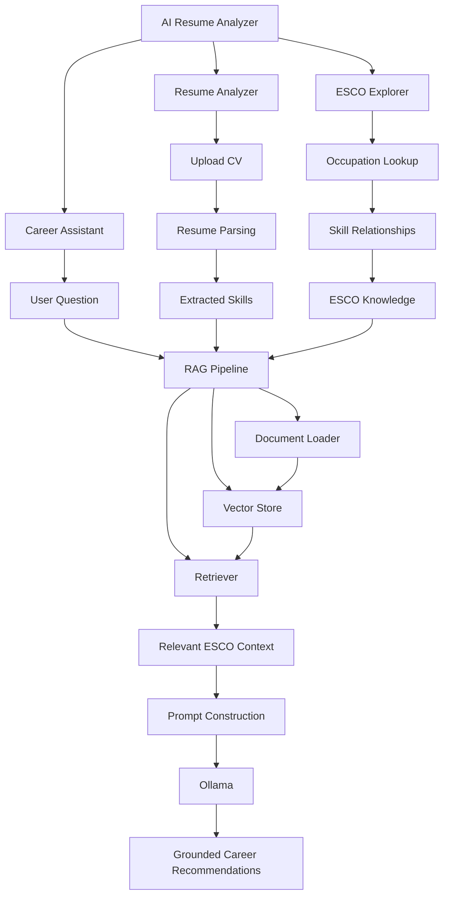

# AI Resume Analyzer

An AI-powered career analysis application that combines **ESCO (European Skills, Competences, Qualifications and Occupations) skill and occupation data**, **retrieval-augmented generation (RAG)**, **local LLM inference with Ollama**, and **Streamlit** to explore occupations and skills, answer career questions, and analyze uploaded resumes.

## Overview

The project demonstrates how structured domain knowledge can be combined with vector retrieval and LLMs.

## Architecture



## Main Features

### ESCO Explorer
- Browse occupations and descriptions.
- Retrieve related skills through ESCO relationships.
- Inspect occupation-skill mappings and URIs.

### RAG Career Assistant
Ask natural-language career questions. The system retrieves relevant ESCO documents first, formats them into context, and then asks Ollama to answer using that retrieved knowledge.

### Resume Analyzer
Upload a CV and analyze it against ESCO knowledge for:
- detected skills;
- related occupations;
- skill gaps;
- recommended skills;
- possible career directions.

## Architecture

```text
Streamlit UI
    ↓
ESCO Explorer / LLM Discussion / Resume Analyzer
    ↓
RAG Layer
    ├── document_loader.py
    ├── vector_store.py
    ├── retriever.py
    └── rag_chain.py
    ↓
Ollama
```

## Project Structure

```text
AI-Resume-Analyzer/
├── main.py
├── data/
│   ├── skill_en.ods
│   ├── occupations_en.ods
│   └── occupationSkillRelations.ods
├── utils/
│   └── data_loader.py
├── models/
│   ├── __init__.py
│   └── ollama_model.py
├── rag/
│   ├── __init__.py
│   ├── document_loader.py
│   ├── vector_store.py
│   ├── retriever.py
│   └── rag_chain.py
├── tests/
├── requirements.txt
└── README.md
```

## ESCO Data

Expected source files:

```text
skill_en.ods
occupations_en.ods
occupationSkillRelations.ods
```

Important relationship fields:

```text
occupationUri
skillUri
```

The application supports both directions:

```text
Occupation → Skills
Skill → Occupations
```

## RAG Pipeline

1. Load ESCO skills, occupations, and relationships.
2. Create one document per skill and occupation.
3. Generate embeddings with sentence-transformer embeddings.
4. Store vectors in a vector store.
5. Retrieve the most relevant documents for a user question.
6. Format the retrieved documents into prompt context.
7. Send the prompt to a local Ollama model.
8. Return a career-focused answer grounded in ESCO information.

Typical retriever configuration:

```python
search_kwargs={
    "k": 15,
    "fetch_k": 30,
}
```

## Ollama

Example model:

```text
llama3.2:3b
```

Pull it with:

```bash
ollama pull llama3.2:3b
```

## Installation

```bash
git clone <repository-url>
cd AI-Resume-Analyzer

python -m venv venv
```

Windows:

```bash
venv\Scripts\activate
```

Linux/macOS:

```bash
source venv/bin/activate
```

Install dependencies:

```bash
pip install -r requirements.txt
```

## Run

```bash
streamlit run main.py
```

## Example Questions

```text
What skills are important for an AI Engineer?
```

```text
Which occupations are related to Python and machine learning?
```

```text
I know Python, statistics and SQL. Which occupations are related?
```

## Testing

```bash
python -m pytest -v
```

Tests should cover:
- data loading;
- Ollama wrapper;
- document generation;
- retrieval;
- prompt construction;
- occupation-skill mapping;
- resume parsing.

## Design Principles

### Local-first inference
The LLM runs locally through Ollama.

### Retrieval before generation
ESCO knowledge is retrieved before the model answers.

### Separation of concerns
Data loading, retrieval, prompt construction, LLM inference, and UI remain separate modules.

### Reusable RAG components
The retrieval layer can later be reused with other domain knowledge.

## Current Limitations

- Retrieval quality depends on embedding quality and document design.
- Small local models may reason less reliably than larger models.
- Resume parsing quality depends on input format.
- ESCO may not cover every emerging technology equally well.
- Retrieval can miss relevant occupation-skill relationships.

## Future Improvements

- Persistent vector storage.
- Hybrid semantic + direct ESCO relationship retrieval.
- Better PDF/DOCX resume parsing.
- Structured skill, experience, and education extraction.
- Skill-gap scoring.
- Retrieval evaluation.
- Model comparison.
- FastAPI serving layer.

## Technologies

- Python
- Streamlit
- pandas
- ESCO
- LangChain
- sentence-transformers
- vector retrieval
- Ollama
- pytest

## Portfolio Skills Demonstrated

```text
RAG system design
Embedding generation
Vector retrieval
Domain knowledge integration
Local LLM inference
Prompt construction
Document processing
Streamlit development
Modular Python architecture
Testing
```

## Future Direction

```text
Resume
   ↓
Extract skills / experience
   ↓
Map to ESCO
   ↓
Retrieve related occupations
   ↓
Calculate skill gaps
   ↓
Generate recommendations
```
